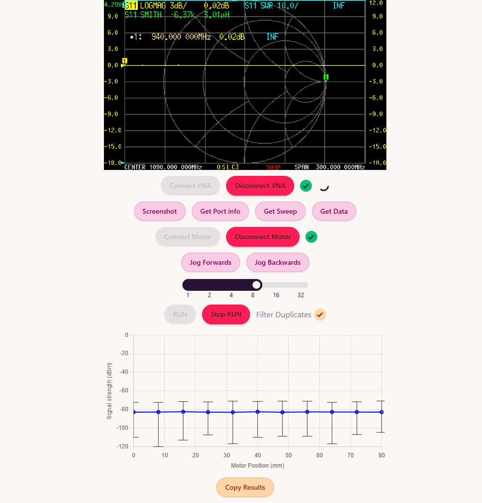

## Web interface for NanoVNA

Connects to a portable Vector Network Analyser with the WebSerialAPI. The `Run` button starts recording the average of the S21 parameter and plots it on the graph. The `Copy Results` button copies the data as TSV so that it can be pasted into Excel/Sheets.
